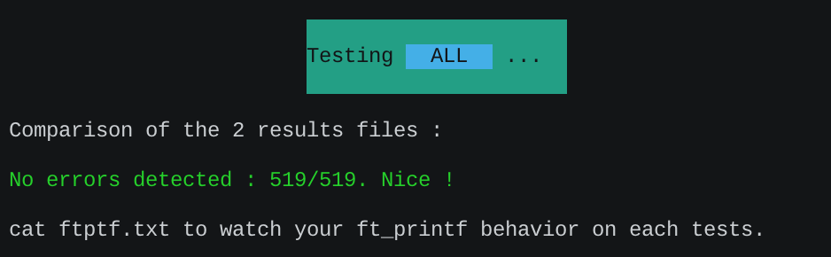
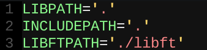

PTFTESTER
-

1. cd in your ftprintf repository.  
2. git clone the ptftester.  
3. cd ptftester.
4. open test.sh to check if includes & lib path are good  
  
5. if there aren't, modify them  
6. ./test.sh [-%cspdux[mix]]  

-------------------------------  

You can specifie options to  
the script to choose which  
printf type you wanna test,  
one by one. If no option  
is specified, it will run  
all tests. It doesn't test  
return value (sorry !).  

*xxxxxxxxxxxx  
xx**20/05/20**xx  
xx**jle-corr**xxxx  
xxxxxxxxxxxx*  
